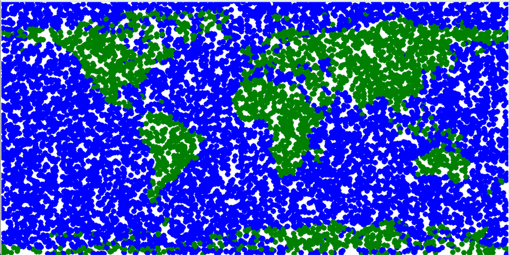

#H31. Class SecondaryView
AI was used to improve the function **generate_base_image**.

This function associates to each point on Earth a color depending on whether it is above or below the sea level value for a given year. At first, we created this function using a dictionary, in which we loaded the data from the .nc file containing the elevation, latitude, and longitude of all points on Earth.

The .nc file has a resolution of 60 arc minutes, so 1°.
The dictionary elevation_dict has the following form:
elevation_dict = { elevation1: [(lat_a, long_a), (lat_b, long_b), ...], elevation2: [(lat_c, long_c), (lat_d, long_d), ...] , ... }.
So each elevation is associated with a list of tuples corresponding to the coordinates (latitude, longitude) of all points at the given elevation.
To create the dictionary elevation_dict, we used a 5° resolution (so extracting every five points from the file) in order to have a loading time not too high.

Then, with our initial function "generate_base_image", for each elevation of the dictionary, if the elevation is below the sea level, on the canvas, around all points of coordinates stored in the associated list, we plot a circle of radius 10 in blue. Else, if the elevation is above sea level, on the canvas, around all points of coordinates stored in the associated list, we plot a circle of radius 10 in green.
This allowed us to obtain the following map: 

We can see that not all the map is uniformly colored, there are blank spaces, and we distinguish the different colored points.
However, when we tried to improve the resolution of the dictionary, the code was running indefinitely and it was impossible to place the million points of the dictionary on the Tkinter canvas.

Thus, we asked AI how to have more precision on our map, without having code running too slowly and without giving too many points to place on the Tkinter canvas.
We wrote the following prompt: *"I have a .nc file with a 60 arc minutes resolution containing the elevation, latitude and longitude of all points on Earth. I loaded the data in the dictionary associating the elevation to a list of coordinates (lat, long) at this elevation, keeping a resolution of 5°. With a function generate_base_image, I want to color each point in blue or green on a canvas depending if its elevation is below or above the sea level given as parameter. When running my code, I obtain the following map (photo of the map joined). There are blank spaces with the resolution of 5°, but if I improve the resolution, too many points have to be placed on the canvas and it doesn't work. So how can I refine the coloring of the map to have no blank space, but avoid the code being too slow and avoid a bug because there are too many points?"*

The answer of AI was that creating a dictionary to color the map was not optimal and it was not adapted to send thousands of points to the Tkinter canvas one after the other. Since we have a .nc file with all the coordinates, it is better to use arrays to associate each coordinate with a color, then create the image and send the obtained image all at once to the Tkinter canvas. The function **generate_base_image** in our final code thus uses the function written by AI, which we adapted in order for it to work within our class **SecondaryView**.

AI was also used to create the functions on_zoom in the class SecondaryView.
It is used to allow zooming (or unzooming) on the map when scrolling with the mouse. We didn't know how to write this code, so we asked AI.

We wrote the following prompt:
*"Can you provide a function allowing to zoom on the map of the Earth (created by the function generate_base_image), where the mouse cursor is placed and unzoom, using the scroll of the mouse?"*

Finally, we had to do the class Profileview. This class shows the elevation of a country from the side. At first, we had a simple code that drew a line of the average elevation and added a blue rectangle to represent the sea, this was loaded onto a canvas (you can find the original code in the script under the name draw_profile). The problem that we had was that we wanted to overlay multiple parts, we wanted to be able to see the land as mountains and the sea in front of it but slightly transparent so that we can still see which parts became submerged. We also wanted to be able to see the elevation on the side. We were not sure how to position all of these things on a canvas. We used the prompt *" please take this code (commented code in the script of class Profile view) and modify it, we need:*
- *everything under the land elevation should be green*
- *we can see the elevation values on the left in a white rectangle*
- *the sea elevation should be in blue and slightly transparent and go to the bottom until the bottom margin*
- *to be able to put a backgroung .jpg image that starts above the sea level "*

